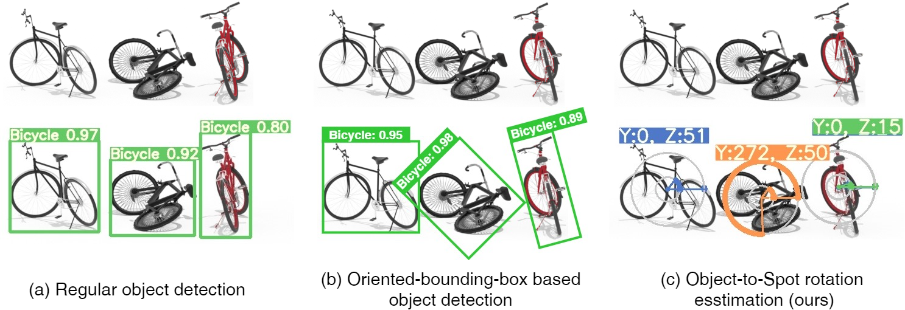
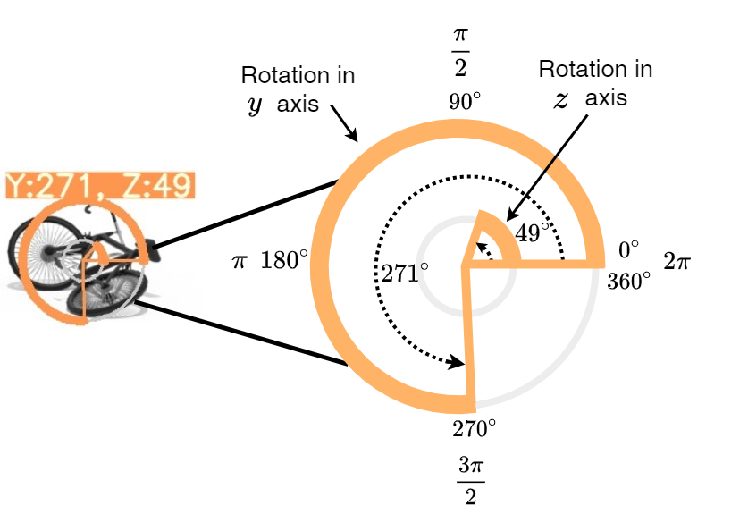
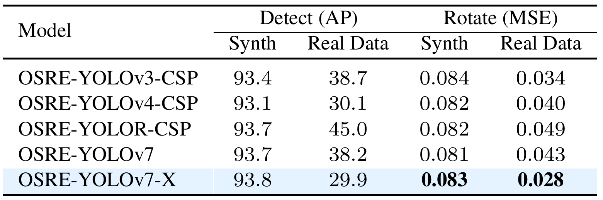
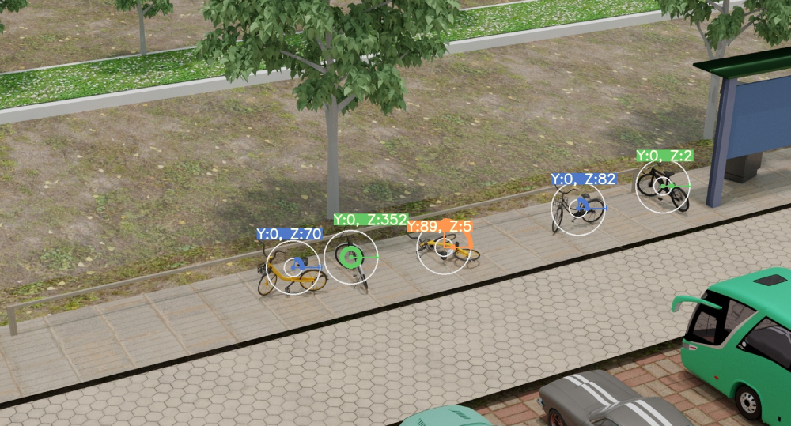
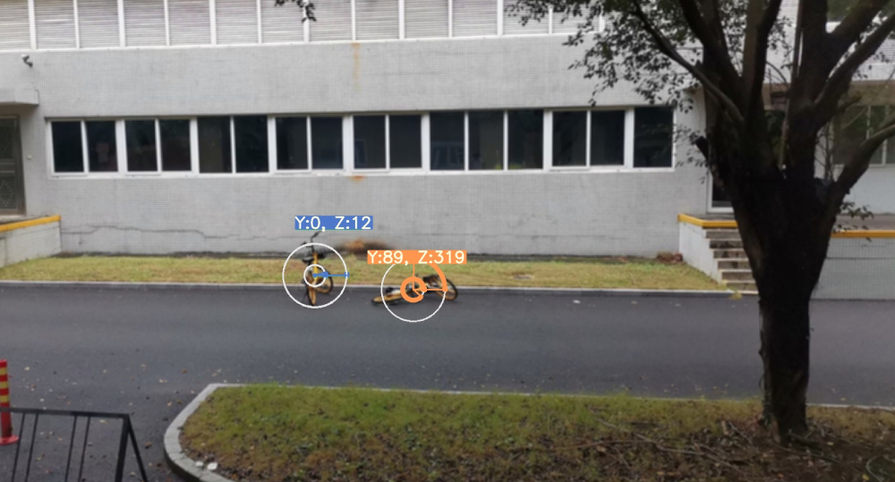

# OSRE: Object-to-Spot Rotation Estimation for Bike Parking Assessment
### [Paper](https://arxiv.org/abs/2303.00725) | [Supplementary](https://arxiv.org/pdf/2303.00725.pdf) | [Website](https://saghiralfasly.github.io/OSRE-Project/) | [Data](https://github.com/saghiralfasly/SynthBRSet) | [Video Demos](https://youtu.be/W-ifWAbRwpM)

This repository is the implementation of the paper ["**OSRE: Object-to-Spot Rotation Estimation for Bike Parking Assessment**"](https://arxiv.org/abs/2303.00725)

## Overview

We leveraged the power of 3D graphics and computer vision techniques to tackle a real-world problem, that we propose object-to-spot rotation estimation which is of particular significance for intelligent surveillance systems, bike-sharing systems, and smart cities. We introduced a rotation estimator (OSRE) that estimates a parked bike rotation with respect to its parking area. By leveraging 3D graphics, we generated Synthetic Bike Rotation Dataset (SynthBRSet) with accurate bike rotation annotations. Next, we presented a first-of-its-type object rotation model that assesses bike parking. As we obtained promising results, we believe this work would be a significant starting point for further deep studies on rotation estimation with respect to other visual semantic elements in the input image.

This repository is based on the [YOLOv7](https://github.com/WongKinYiu/yolov7) structure and assumes that all dependency for training [YOLOv7](https://github.com/WongKinYiu/yolov7#installation)  is already installed.

<p align="center">
 <p float="left">  
</p>


 <p align="center">

</p>

**Object-to-Spot Rotation Estimation.** Our proposed object-to-spot rotation estimation method provides two rotation angle predictions in two axes $y$ and $z$. Rotation in $y$ axis represents the bicycle leaning/falling left or right. When it is fallen down to the left side, it represents the angle $90^\circ$ or $\pi/2$ in radians, whereas falling down to the right size is representing the $270^\circ$ or $3\pi /2$. Similarly, rotation in $z$ axis represents the bike direction in its standing pose. i.e., (C) shows the rotated bike in $z$ axis ( ```rotated``` class) in blue color, the bikes lean left/right ( ```fallen``` class) are shown in orange color, and the well-parked bikes ( ```parked``` class) are plotted in green color. We visualize $z$ rotation in the inner circle and $y$ is visualized in the outer circle.

<p align="center">           
<p float="left">  
</p>

**Rotation Visualization.** We represent rotation in two axes, the outer angle represents the rotation of the object (e.g., bike) in $y$ axis, whereas the inner angle represents the object rotation in $z$ axis. We assume the bike well parked is not rotated in either axes. Rotating the bike in $y$ axis leads to leaning the bike and/or fall it down in the ground. The rotated bike in $y$ axis may and may not be associated with rotation in $z$ axis at the same time. However, bikes can be rotated only in $z$ axis which indicates that it is standing and parked but in an inaccurate direction.


## Datset Preparation
The proposed OSRE was trained on [Synthetic Bike Rotation Dataset (SynthBRSet)](https://github.com/saghiralfasly/SynthBRSet) dataset. Follow the instructions in [SynthBRSet](https://github.com/saghiralfasly/SynthBRSet) to generate the dataset. The generated dataset will be in Yolo annotation formate. It involves the rotation annotation of each bike. The generating code creates COCO annotation as well. Synthetic Bike Rotation Dataset (SynthBRSet) contains a wide variety in lighting, objects' colors, objects' poses, camera view, and scenes.
<br/> 
<p float="left"> 
 
</p> 

Overall, the dataset includes the **images** and **annotations** directories. It is expected to have the generated synthetic dataset in the following dirctory structure:

```
SynthBRSet
│   images
│       └─000001.jpg
│       └─000002.jpg
│       └─000003.jpg
|   labels
│       └─000001.txt
│       └─000002.txt
│       └─000003.txt


```
Each line of each annotation file involves the rotation annotation of the bicycle in two axes $y$ and $z$. Rotations are read in radian, then normalization into `[0-1]`.
```
Example the annotation file 006444.txt:

cls    x        y        w        h        θy       θz
 1   0.533666 0.539923 0.028769 0.156479 0.500000 0.482248


```
## Training OSRE
Train a suitable model  by running the following command using a pretrained Yolov7 CKPTs. This provides better performance than training the model from scratch. To train the model ```OSRE-yolov7-IDetect``` in a single GPU with Yolov7 baseline ```yolov7-IDetect```, input resolution ```640 x 640```, and a weighted rotation loss 0.1, first, download [yolov7.pt](https://github.com/WongKinYiu/yolov7/releases/download/v0.1/yolov7.pt).

```
python train.py  --batch-size 16 --epochs 100 --data data/OSRE_dataRotation.yaml --img 640 640 --cfg cfg/training/OSRE-yolov7-IDetect.yaml --name Exp_OSRE_yolov7_Rotation_loss_0_1 --weights weights/yolov7.pt --hyp data/hyp.scratch.Rotation_loss_01.yaml 
```
To train the same model in a distributed multi-GPU mode, e.g., ```8 GPUs```: 
```
python -m torch.distributed.launch --nproc_per_node 8 --master_port 9527 train.py  --workers 8  --batch-size 64 --epochs 100 --data data/OSRE_dataRotation.yaml --img 640 640 --cfg cfg/training/OSRE-yolov7-IDetect.yaml --name Exp_OSRE_yolov7_Rotation_loss_0_1 --weights weights/yolov7.pt --hyp data/hyp.scratch.Rotation_loss_01.yaml
```
## Testing OSRE
To test a trained model (e.g., ```OSRE-yolov7-IDetect```) on a synthetic or real testing set (The testing set path is specified in ```data/OSRE_dataRotation.yaml ```): 

```
python testRotation.py --data data/OSRE_dataRotation.yaml --cfg cfg/training/OSRE-yolov7-IDetect.yaml --img 640 --batch 1 --conf 0.001 --iou 0.65 --device 0 --weights weights/osre.pt --name OSRE_yolov7_640_val
```

## Detect (inference in images or videos)

```
python detectRotation.py  --img-size 640 --conf 0.3 --iou 0.65 --device 0 --weights osre.pt --source inference/videos_smoothed_with_2D_convolution
```

## Results
Performance of the proposed OSRE on top of several object detection baselines. The models are trained on half SynthBPSet excluding the challenging set and evaluated on SynthBPSet and the real sets.



* Here are samples of the proposed method performance on synthetic image (in the left) and on real collected image (in the right).

 Performance on Synthetic Image             |  Performance on Real Image 
:-------------------------:|:-------------------------:
 |  

## Citation 
```
@article{alfasly2023OSRE,
  title={OSRE: Object-to-Spot Rotation Estimation for Bike Parking Assessment},
  author={Saghir, Alfasly and Zaid, Al-huda and Saifullah, Bello and Ahmed, Elazab and Jian, Lu and Chen Xu},
  journal={arXiv preprint arXiv:2303.00725},
  year={2023}
}
```
## Acknowledgements 

The code is built upon [YOLOV7](https://github.com/WongKinYiu/yolov7)
